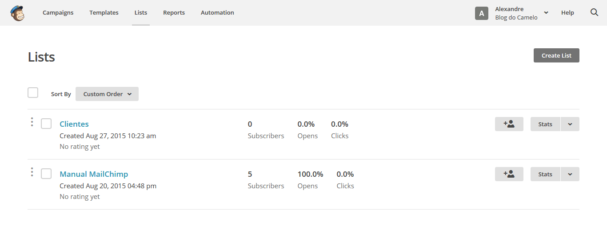
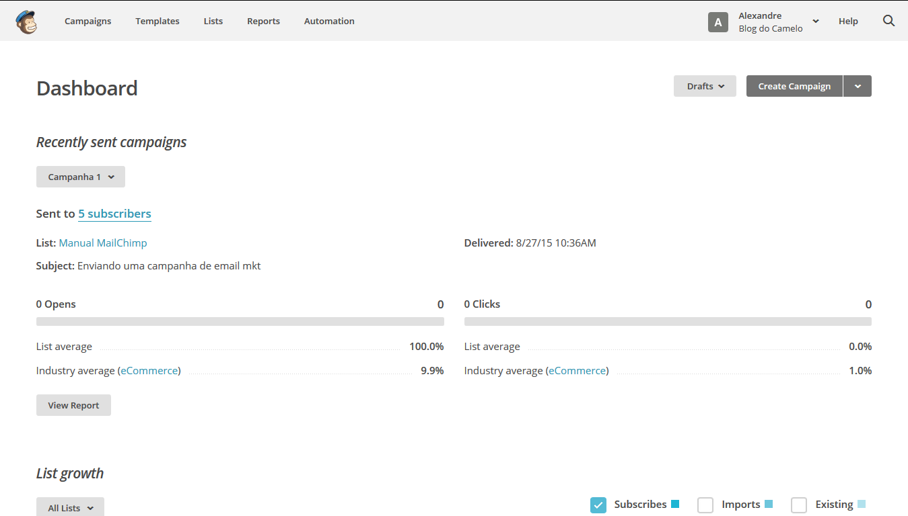
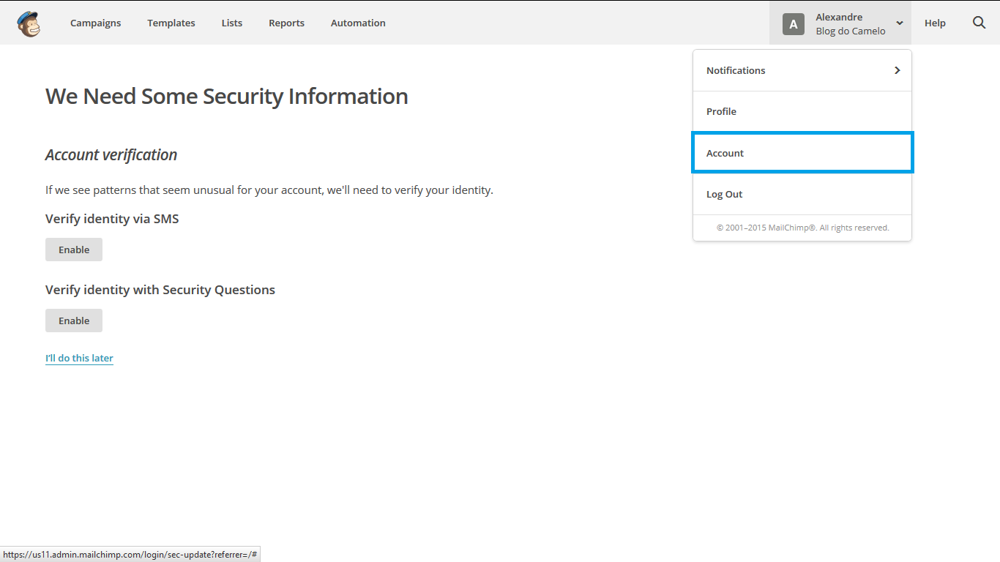
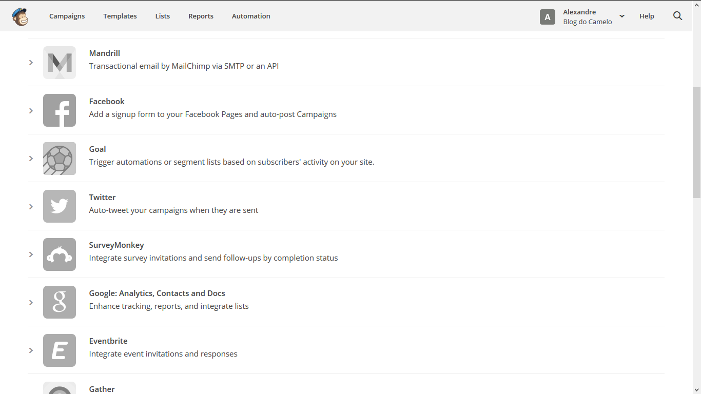

# Introdução

No mundo do Marketing Digital a prática do e-mail Marketing é uma das principais táticas de uma estratégia de sucesso.
Na era das redes sociais, o e-mail marketing mais uma vez prova ser uma ótima forma de comunicação, tanto para aperfeiçoar a comunicação nas redes sociais como para um publico que não está nelas.

# O que é o e-mail marketing?

E-mails Marketing nada mais são que uma prática que consiste no envio de e-mails a um banco de dados de clientes ou clientes potenciais que foram cadastrados através de alguma landing page, no MailChimp não é recomendável sem a autorização do destinatário, caso isso aconteça pode acontecer desde o cancelamento do envio da campanha até a exclusão do usuário do administrador da conta do MailChimp.

Logo percebemos a importância de termos uma plataforma que seja de confiança, eficiente e vantajosa, pois sendo assim, a comunicação com os clientes vai funcionar da melhor forma possível.
O MailChimp é uma poderosa ferramenta para o envio de campanhas de ação por e-mail, essa plataforma funciona totalmente pela internet e permite o controle total de todo o processo do e-mail marketing.

Para completar a facilidade de criação de campanhas, o MailChimp ainda oferece:

* Testes A/B para suas campanhas;
* Múltiplos administradores de uma mesma conta;
* API’s e integração com o Facebook;
* Personalização de campanhas;
* Relatórios de desempenho;
* Integração com redes sociais;
* Monitoramento a partir do Google Analytics;
* Taxa de abertura de mensagens;
* Templates para celulares;
* Agendamento de envios;
* Segmentação de suas bases por idade, sexo e muito mais.

###Tipos de planos
###Plano Gratuito

O MailChimp possui entre seus diversos planos a possibilidade de criar uma conta gratuita, a conta gratuita da plataforma leva uma vantagem enorme em relação aos seus concorrentes devido a possibilidade de ser inserido um grande número de assinantes.
As principais características do plano gratuito são:

* Até 2000 inscritos
* 12.000 envios de e-mails por mês

Para mais detalhes sobre as vantagens de se ter um plano gratuito acesse o link http://mailchimp.com/pricing/free/

**Growing Business** (Negócio crescente): permite criar uma conta para ter até 600.000 assinantes.

**High volume sender** (Alto volume de remetentes): permite criar uma conta para ter mais de 600.000 assinantes.

**Pay as you go** O plano Pay as you go é um plano onde não há necessidade de cadastro, com ele é possível comprar "créditos" e com esses créditos usar os disparos de e-mail conforme a necessidade.

###Interface

A interface do MailChimp é uma interface bastante limpa, o que proporciona uma grande sensação de uma ferramenta simples de se usar o que cativa usuários de todos os níveis.

Ao fazer login é apresentado ao usuário as atividades recentes da sua lista, isto é bastante útil pois permite obter informações chave como a última vez em que foi logado ou disparou uma campanha.

###Integração

O MailChimp possui a possibilidade de integração com diversas plataformas. Para verificar a integração do MailChimp clique na área superior do site no seu nome de usuário e acesse a opção Account.

Na janela que abre a seguir clique em Integrations.

É possível fazer integração com plataformas como, Facebook, Twitter, Google Analytics entre outras.

