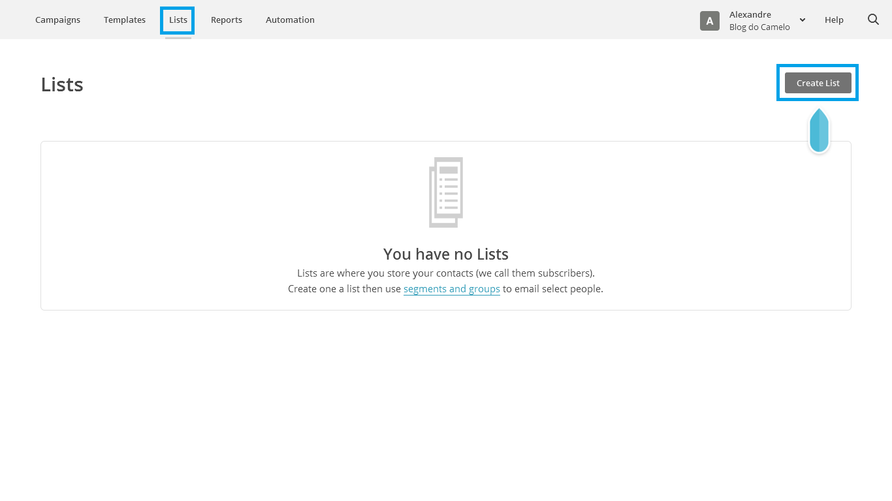
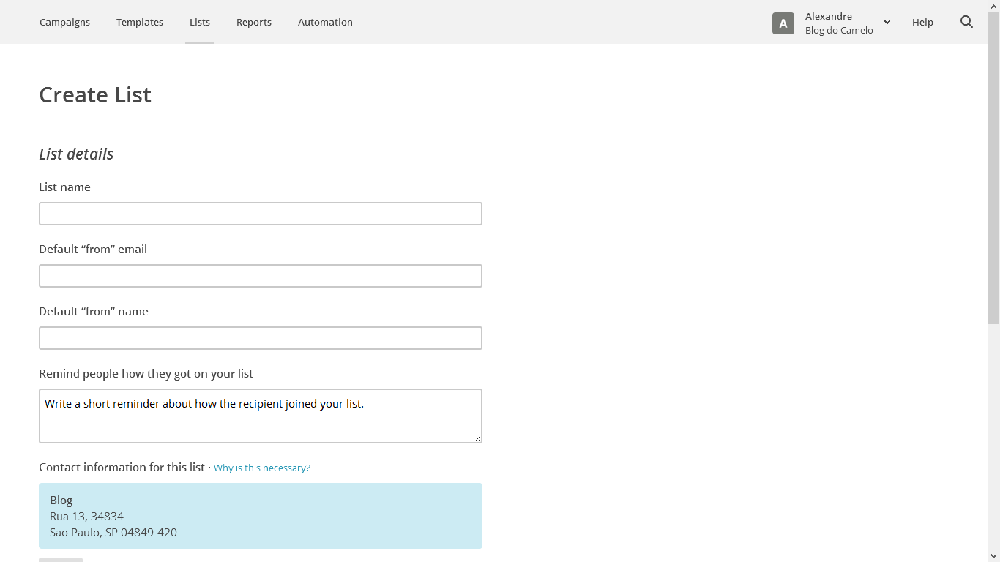

# Listas

As listas no MailChimp nada mais é que um Banco de Dados onde ficam cadastrados os e-mails das pessoas para quem vamos disparar os e-mails portanto antes de criarmos alguma lista devemos considerar os seguintes pontos:

### Separe suas listas por tipo de cliente

Para manter uma organização plena das listas no MailChimp é altamente recomendável que sejam criadas listas diferentes para cada propósito, porém não é ideal criar listas o tempo todo, o melhor, pelo menos no inicio é bom criar apenas uma lista, assim, mantendo-a atualizada o tempo todo, se o seu desejo é direcionar seções específicas de uma única lista, use grupos na mesma. Isso ajuda a reduzir o volume de tarefas.

### Não exclua as listas se não for extremamente necessário

Uma vez apagando uma lista podemos dizer que todo o histórico com o cliente foi perdida, não apagando uma lista evitamos, por exemplo, que perdemos clientes inativos.

### Exclusão e cancelamento de assinatura

Quando alguém da sua lista cancela sua assinatura significa que não querem mais receber os e-mails, sendo assim devem ser excluídos, você ainda pode encontrá-los  em sua lista, envie-os para o perfil "Subscription Cancelado", só tome cuidado para não importar novamente os contatos cancelados acidentalmente na lista de ativos.

### Criando Listas

No menu superior do site clique em Lists, em seguida clique em **Create List**.

Após clicar em Create List teremos que preencher o formulário que aparecerá como mostra a figura acima:

