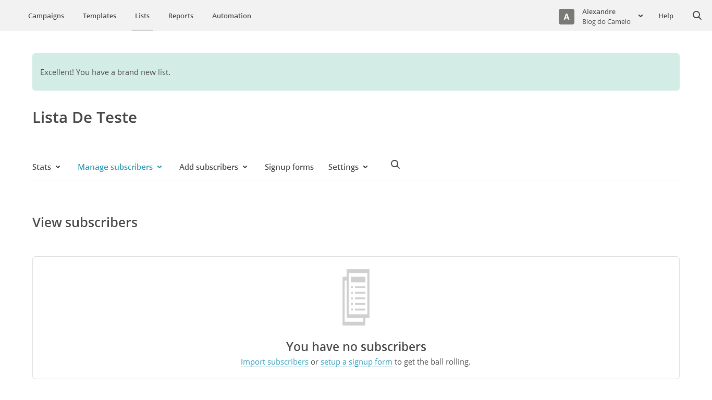
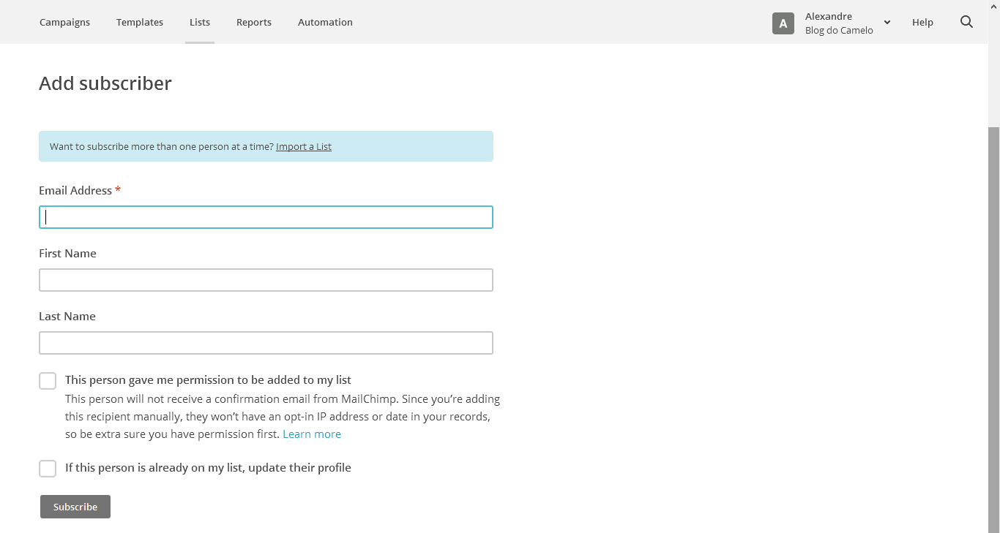
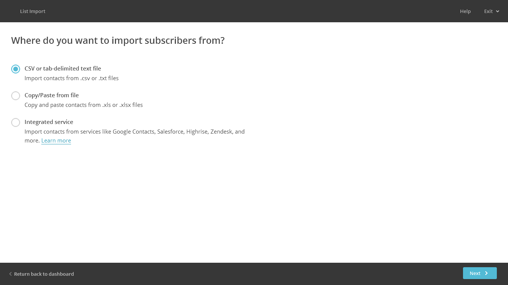
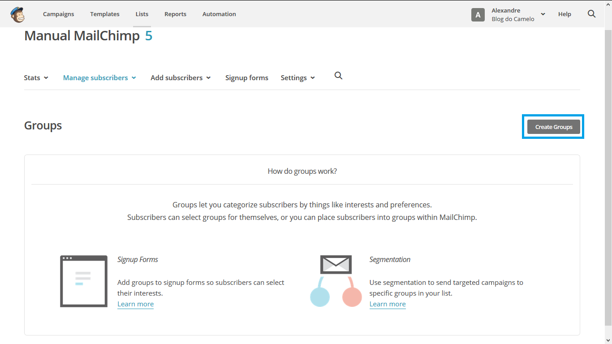
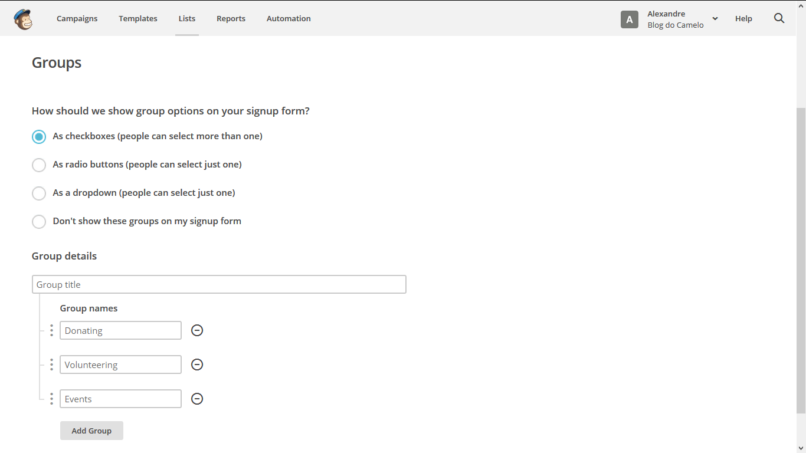
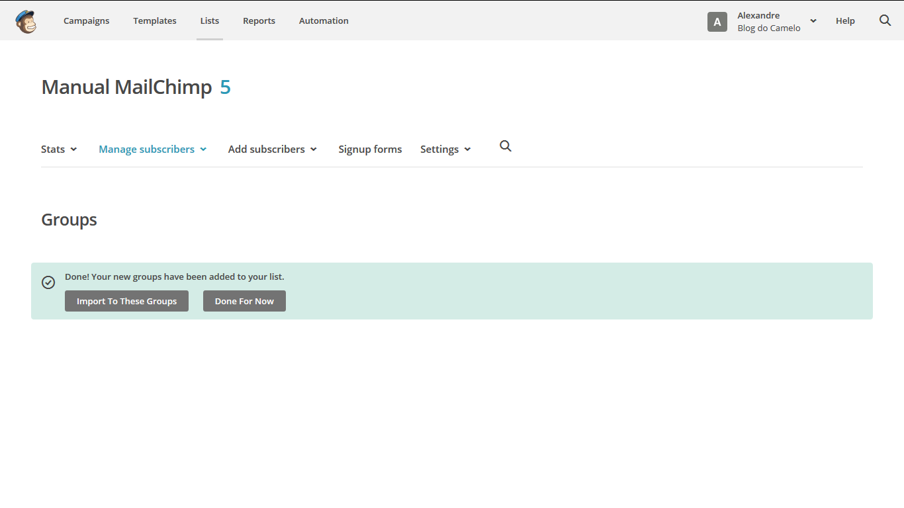
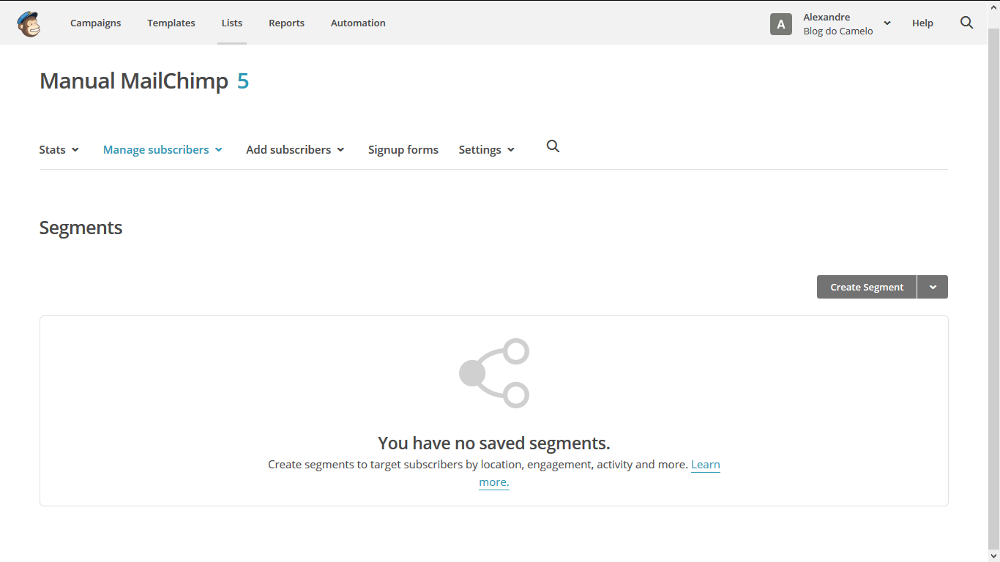
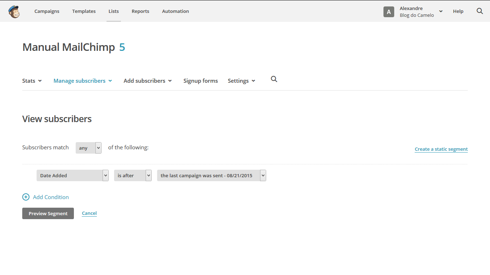
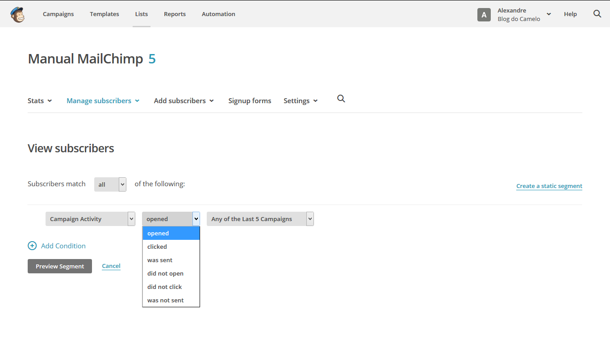
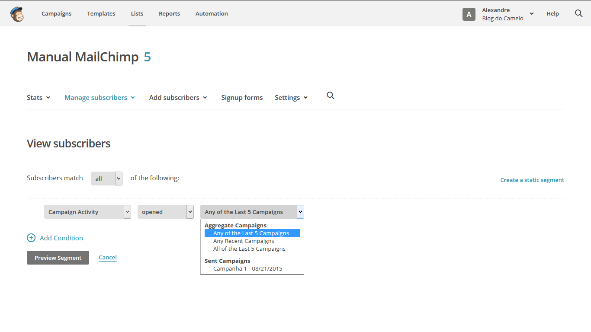

# Listas

As listas no MailChimp nada mais é que um Banco de Dados onde ficam cadastrados os e-mails das pessoas para quem vamos disparar os e-mails portanto antes de criarmos alguma lista devemos considerar os seguintes pontos:

### Não exclua as listas se não for extremamente necessário

Uma vez apagando uma lista podemos dizer que todo o histórico com o cliente foi perdida, não apagando uma lista evitamos, por exemplo, que perdemos clientes inativos.

### Exclusão e cancelamento de assinatura

Quando alguém da sua lista cancela sua assinatura significa que não querem mais receber os e-mails, sendo assim devem ser excluídos, você ainda pode encontrá-los  em sua lista, envie-os para o perfil "Subscription Cancelado", só tome cuidado para não importar novamente os contatos cancelados acidentalmente na lista de ativos.

### Criando Listas

No menu superior do site clique em Lists, em seguida clique em **Create List**.

Após clicar em Create List teremos que preencher o formulário que aparecerá como mostra a figura acima:

* **List name**: Devemos escolher um nome para a lista esse nome será visto pelas pessoas cadastradas nela, portanto, faça uma escolha adequada.

* **Default “from” e-mail**: Inserir o e-mail para o qual as pessoas poderão responder.

* **Default “from” name**: Inserir o nome da empresa ou o seu próprio.
Remind people how got on your list: Digite uma mensagem explicando por que a pessoa está recebendo esse e-mail. Essa frase estará publicada no rodapé dos e-mails enviados para essa lista.

* **Notifications**: Podemos programar para receber avisos dos assinantes novos ou cancelados. Esses avisos podem ser individuais ou um resumo diário.

Clique em **Save** para continuar o processo de criação da lista.

Após clicar em Save veremos uma tela como a mostrada na imagem abaixo, nela encontramos:

* **Stats**: Aqui temos as estatísticas da lista, por exemplo, quantas pessoas abriram as campanhas, quais provedores de e-mail elas usam e outras informações.

* **Manage subscribers**: Permite criar segmentos para a sua lista,  exemplo, podemos criar um grupo de pessoas para os quais gostaríamos de enviar um e-mail especifico, com isso evitamos de criar novas listas.

* **Add subscribers**: Esta opção serve para adicionar inscrições manualmente ou importar de um arquivo CSV.

* **Sign up forms**: Esta opção serve para criar e customizar formulários de inscrição.

* **Settings**: Aqui é onde mudamos nossas configurações para a lista em questão, como nome ou e-mail.

Há duas maneiras de acrescentar e-mails à lista:

* **Add a subscriber**: Permite adicionar e-mails de forma individual.
* **Import subscribers**: Permite importar vários e-mails de uma só vez, esses e-mails podem ser importados de diversas formas, arquivos CSV, de contas de e-mail e etc.

### Add a subscriber - Adicionar um assinante

Cadastrar e-mails individualmente para uma lista.
Em Add subscribers clique em Add a subscriber

Preencha os dados do contato, neste formulário somente o e-mail é dado como obrigatório.

Após o preenchimento clique para confirmar que temos a autorização da pessoa em questão no e-mail para receber nossos e-mails, é importante não termos problemas com spam.

Clique no botão **Subscriber** para finalizar.

### Import subscribers - importar dos e-mails

Se escolhermos a opção **Imports subscribers**, podemos cadastrar vários e-mails de uma só vez usando nossos arquivos ou as integrações oferecidas pelo MailChimp como podemos ver na imagem a seguir:

* CSV or trab-delimited text file: Esta opção serve para cadastrar vários e-mails podemos importar um arquivo CSV ou TXT.
* Copy/Paste from file: Com esta opção podemos copiar e colar os dados de um arquivo Excel.
* Integrated service: Permite usar uma das muitas integrações que o MailChimp oferece.

### Criando grupos em uma lista

Os grupos são uma ferramenta muito poderosa quando temos como alvo assinantes com distintos interesses e preferências dentro de uma lista, assim não temos que gerenciar diversas listas.  Os grupos podem ser usados para qualquer coisa que desejamos filtrar a lista.

Para criar grupos clique em List na parte superior direita da tela do MailChimp, clique sobre o nome da lista onde deseja fazer o grupo. Clique no menu **Manage Subscribers** em seguida em **Groups**.

Clique em **Create Groups** localizado na parte superior direita da tela como mostra a imagem abaixo:

Selecione uma opção de como os grupos irá aparecer em seu formulário de inscrição, ou selecione a opção para não exibi-los.

* As checkboxes "caixas de seleção": as pessoas podem selecionar mais de um;
* As radio buttons "botões de rádio": as pessoas podem selecionar apenas um;
* As a dropdown: as pessoas podem selecionar apenas uma;
* Don't show these groups on my signup form: Não mostrar esses grupos no meu formulário de inscrição;

Crie um título para o grupo e um nome de Grupo. O título de grupo serve como uma categoria geral para os grupos, a fim de manter as opções semelhantes em conjunto, e é visível para os assinantes. É melhor escolher algo descritivo, como "O que achou dos nossos serviços?" e usar os nomes de grupo para apresentar diferentes opções.

Para adicionar mais nomes de grupo, clique no botão **Add Group Button**.

Clique em **Save**.

Aparecerá uma mensagem indicando que o processo foi realizado com sucesso, você pode optar por importar estes grupos (**Import to These Groups**) ou clique em Concluído (**Done For Now**).

Um erro muito comum, que muitos cometem, é enviar o mesmo e-mail para todos, todas às vezes, isso é um erro porque se pararmos para pensar existe dentro de uma lista uma grande mistura de potenciais clientes.

Podemos fazer uma segmentação, por exemplo, para eliminar os assinantes inativos, ou seja, aqueles que faz algum tempo que não tem aberto os e-mails durante um grande período de tempo.

Clique em Lists na parte superior direita do MailChimp, em seguida clique na lista em questão, em **Manage subscribers** clique em **Segments**.

Por último clique em **Create Segment**, teremos uma janela como mostra a figura abaixo:

Na janela que abriu devemos criar uma regra para a segmentação, no caso da figura abaixo estamos segmentando a lista para os assinantes que não abriram os 5 últimos e-mails, imaginando assim que iremos apagar da nossa lista esses e-mails.

Pode-se criar uma nova condição clicando em **Add Condition** e fazer uma pré-visualização do segmento clicando em **Preview Segment**.

Clique em **Preview Segment** para visualizar o segmento, se estiver de acordo com as expectativas clique em **Save Segment**.

A listagem de tipos de segmentação é muito grande e vai de acordo com as necessidades do administrador da lista, na imagem abaixo vemos em Campaign Activity, podemos utilizar os critérios:

* opened (aberto)
* clicked (clicado)
* was sent (foi enviado)
* did not open (não abriu)
* did not click (não clicou)
* was not sent (não foi enviado)

e ao lado temos:

* Any of the Last 5 Campaigns (Qualquer das últimas 5 Campanhas)
* Any Recent Campaigns (Quaisquer Campanhas recentes)
* All of the Last 5 Campaigns (Todas as últimas 5 Campanhas)

Então em um exemplo simples basta só combinar as diversas opções de critérios para fazer a segmentação de acordo com as necessidades.