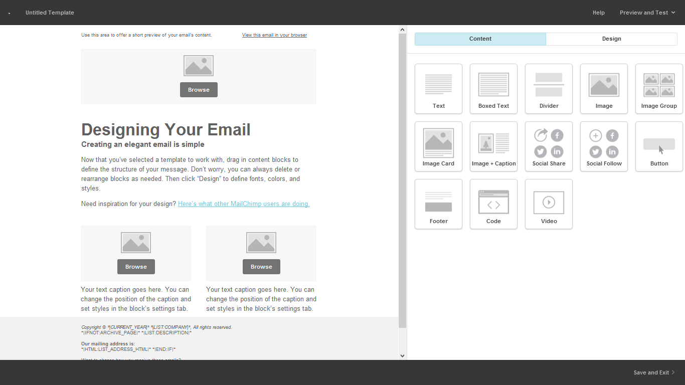

# Templates

O template é a "fase final" é o que o seu leitor/cliente irá receber no e-mail,  sendo assim a escolha de um template é muito importante e determinante para que você consiga fazer com que o leitor não apague o seu e-mail assim que abrir.

Podemos escolher entre os diversos templates disponíveis na plataforma ou podemos criar um template personalizado de acordo com a identidade visual do site/empresa, com pouquíssimos cliques conseguimos editar textos, imagens e personalizamos o e-mail para que tenhamos êxito em conseguir que o leitor faça a ação que desejamos.

No menu superior clique em Templates, em seguida, Create New Template,iremos encontrar uma janela como mostra a imagem abaixo, onde temos 3 maneiras de criar um template:

* **Basic**: montamos o e-mail como queremos.
* **Themes**: escolhemos um dos layouts disponíveis na plataforma.
* **Code your Own**: para usuários que tem conhecimento de programação.

Para dar segmento vamos focar na opção Basic.

As miniaturas que representam os tipos de templates disponíveis na opção Basic tornam a escolha de um template bem prática uma vez que são bem explicativos. Selecione uma estrutura para o e-mail, por exemplo, 1, 2 ou 3 colunas clicando no botão Select do template escolhido.

Agora temos que fazer a edição do layout. A tela de edição é dividida em 2 áreas como mostra a imagem abaixo: temos um preview do e-mail marketing à esquerda e a área de edição à direita que é dividida em Content e Design.

* **Content**: Aqui conseguimos editar o conteúdo do e-mail, adicionando caixas de textos, imagens, botões de redes sociais, colunas e etc. A plataforma permite uma inclusão bem simplificada desses itens bastando apenas usar o recurso de "arrastar e soltar" na área de edição.

* **Design**: Permite que você edite a aparência geral do seu e-mail, como header, body, footer, fontes, alinhamento e etc.

* **Text**: o conteúdo principal do e-mail;
* **Boxed text**: um texto dentro de uma área customizável;
* **Dividers**: linhas que podem dividir as áreas do layout;
* **Image**: adiciona uma imagem;
* **Image group**: imagens unidas em um grid, como 4 fotos lado a lado;
* **Image card**: uma imagem com uma área para legenda;
* **Image + caption**: uma imagem com texto / legenda que pode ser alinhado;
* **Social share**: possibilita o compartilhamento do e-mail nas redes sociais;
* **Social follow**: possibilita linkar suas redes sociais no e-mail;
* **Buttons**: para inserir botões clicáveis no e-mail;
* **Footer**: é o rodapé do e-mail;
* **Code**: permite adicionar seu próprio HTML ao layout;

Após concluir todas as edições necessárias clique em **Save & Exit** localizado no canto inferior direito da página. Feito isso, o layout ficará salvo permitindo assim que possa ser usado em futuras campanhas.

