# Campanhas

Como o próprio nome diz, nesta área poderá criar nossas campanhas, as campanhas são basicamente o que é enviado para os leitores, sendo assim, para criar uma campanha é preciso ter uma lista previamente criada.

Para criar uma campanha clique em **Create Campaign** na parte superior da tela.

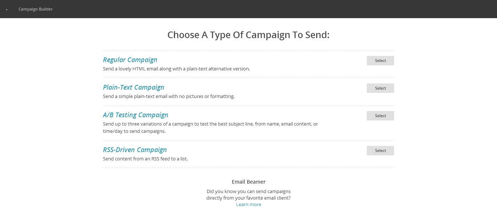

Para criar uma campanha clique em **Create Campaign** na parte superior da tela.

* **Regular Campaign**: Criamos uma campanha simples, usual;
* **Plain-Text Campaign**: Enviar um e-mail simples de texto simples, sem imagens ou formatação;
* **A/B campaign**: Enviar até três variações de uma campanha para testar a melhor linha de assunto, de nome, o conteúdo de e-mail, ou de hora / dia para enviar campanhas;
* **RSS Driver Campaign**: Enviar o conteúdo de um feed RSS para uma lista;

Clique em **Regular Campaign**, na janela seguinte é necessário preencher algumas informações referentes à campanha, informações como:

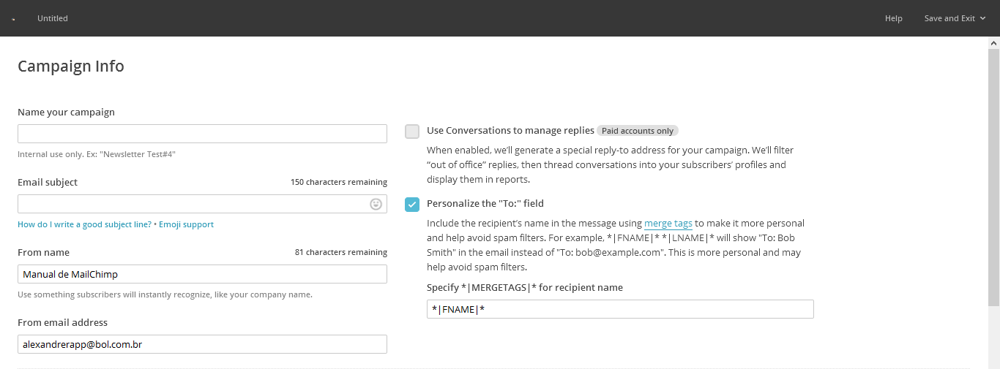

* **Name your campaign**: Digite um nome para sua campanha, este nome não é visível pelos leitores;
* **E-mail Subject**: Digite um título para seu e-mail, esse título precisa ser cativante, pois precisa incitar o leitor a abrir o e-mail;
* **From name**: Digite aqui o nome de quem está enviando o e-mail, pode ser o nome de uma determinada pessoa, o nome da empresa e etc;
* **From e-mail address**: Digite aqui o e-mail do remetente para qual as pessoas possam responder ao e-mail caso queiram;
* **Saved Template**: Para adicionar um template personalizado, depois disso, edite o conteúdo conforme necessário;

### Personalizando uma Campanha

Para personalizar uma campanha é muito simples, tudo o que devemos fazer é clicar sobre um componente do design do lado esquerdo que do lado direito veremos tudo o que é possível personalizar no mesmo, na imagem abaixo vemos como personalizar a aparência do texto.

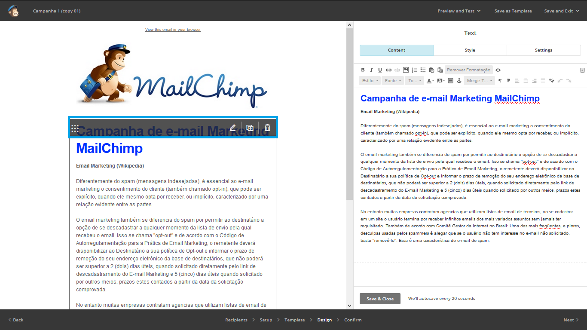

### Aba Design

Na aba design podemos visualizar todos os componentes que formam a campanha, assim conseguimos personalizá-los de acordo com as nossas necessidades.

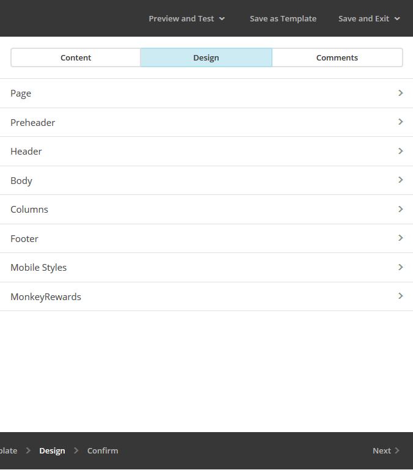

### Personalize o Footer (Rodapé) da campanha

O Footer é o rodapé da campanha, e o footer pode ser totalmente personalizado, assim como qualquer outra parte da campanha.
É muito importante preencher corretamente as informações do rodapé da campanha.

### Personalizando o Footer

Com a campanha aberta clique em Design.

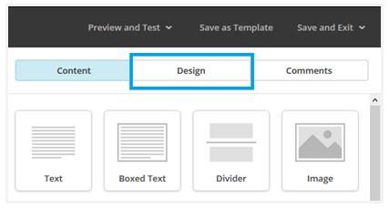

Escolha a opção Footer na aba Design.

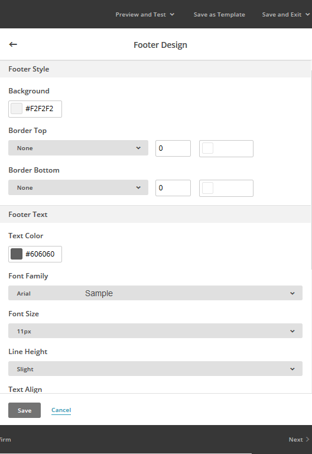

Aparecem algumas seções que podem ser personalizadas de acordo com as suas necessidades, faça as personalizações e clique no botão **Save**.

É possível visualizar como o e-mail vai ficar em computadores e em celulares, para fazer uma pré-visualização do seu e-mail clique em Preview and Test na parte superior direita da tela, clique em seguida em **Enter Preview Mode**.

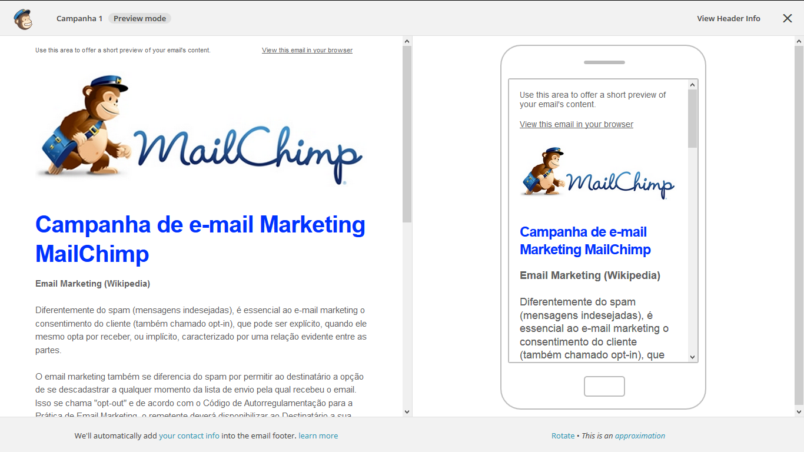

Após fazer a pré-visualização do e-mail podemos fechar esse modo clicando no "X" que fica ao lado do botão **View Header Info** na parte superior direita da tela.

Faça os ajustes se considerar necessário, se necessário pode-se enviar também um teste para o endereço de e-mail que quiser clicando em **Preview and Test** em seguida em **Send a Test** e-mail para enviar um e-mail de teste para algum e-mail, é interessante essa opção para vermos em tempo real  como se comporta a campanha em diversas plataformas de e-mail.

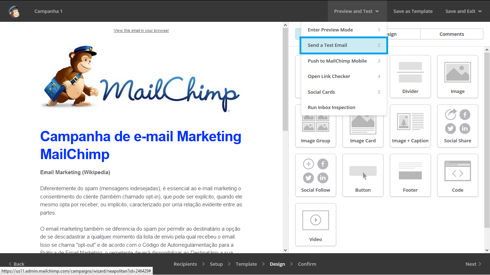

Clique em **Next** para irmos para a próxima etapa, feito isso a seguinte janela aparece:

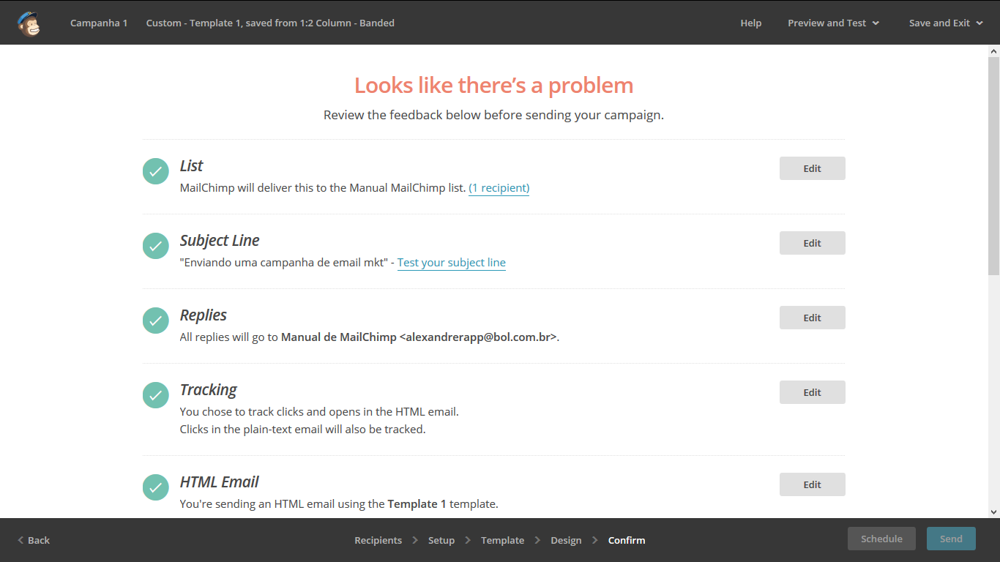

Nessa tela conseguimos enxergar todos os passos que foram feitos anteriormente até então, geralmente o e-mail já está pronto para ser enviado, todavia pode ser também que tenha acontecido algum erro no decorrer do processo, sendo assim, aparecerá um "**X**" em uma das etapas e o erro deverá ser corrigido para que o e-mail possa ser enviado corretamente.

### Social Cards

O **Social Cards** é uma forma de integração da sua campanha com as rede sociais, com ele podemos criar um "resumo" da campanha para ser compartilhado em redes sociais como Facebook e Twitter.

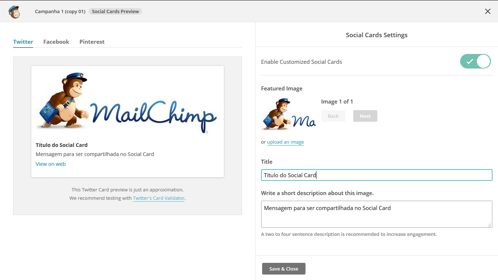

Após corrigir os possíveis erros podemos programar a campanha para ser enviada clicando no botão **Schedule**.

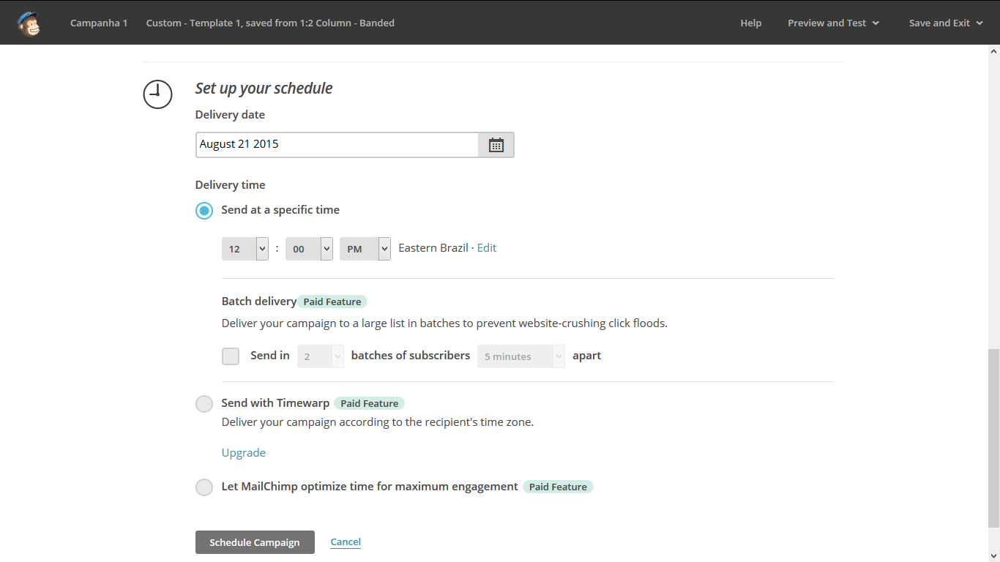

Após corrigir os possíveis erros podemos enviar a campanha clicando no botão Send ou programar para ser enviada em um dia e horário escolhidos pelo remetente clicando no botão **Schedule**.

Caso opte por programar o e-mail para ser disparado em uma data especifica escolha a data em que o e-mail vai ser enviado clicando no botão **Delivery Date**, em **Delivery Time** podemos especificar a hora  do disparo.

Em **Send with Timewarp** pode-se programar o e-mail para ser enviado de acordo com o fuso-horário do destinatário.

Em **Let MailChimp** optimize for maximum engagement o MailChimp indica o melhor horário para ser enviado o e-mail.

Faça as devidas configurações e clique em **Schedule Campaign**.
