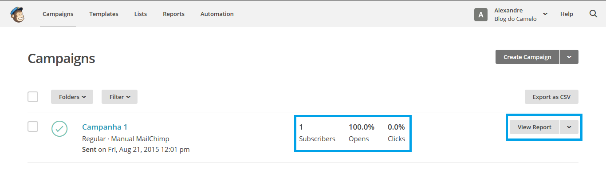

# Relatórios

###Monitorando os envios

Podemos acompanhar o resultado dos envios das campanhas através de relatório que o próprio MailChimp oferece, para visualizar um relatório clique em Campaign no menu superior, na janela que abre a seguir já temos uma prévia de resultados ao lado do nome da campanha como mostra a figura abaixo, para ver mais detalhes basta clicar no botão **View Report**.

Após clicar em **View Report** teremos uma janela como mostra a figura a seguir, nessa janela teremos dados como taxa de abertura, taxa de cliques, quantas pessoas cancelaram a assinatura da sua lista.

* **Recipents**: Número de assinantes da campanha foi enviada;
* **Delivered**: Data e hora que a campanha saiu dos servidores do MailChimp;
* **Open rate**: Porcentagem de campanhas entregues com êxito e que foram abertas;
* **Click Rate**: Porcentagem de campanhas entregues com êxito que registraram cliques;
* **List average** for opens and clicks: Percentual médio de aberturas ou cliques em campanhas anteriores enviadas para a mesma lista;
* **Opened**: Número de destinatários que abriram;
* **Clicked**: Número de destinatários que clicaram em qualquer link na campanha em questão;
* **Bounced**: Representa os e-mails que foram enviados, mas que, por alguma razão, ‘quicam’ da caixa de entrada do recipiente e voltam para o servidor de origem. É importante não confundir com o bounce do seu website, que também é um “quique” porém de um visitante no site e não de um e-mail;
* **Unsubscribed**: Número de assinantes que escolheram sair da lista usando o link de cancelamento na campanha enviada;
* **Total opens**: Número de vezes que a campanha foi aberta pelos destinatários;
* **Successful deliveries**: O número de destinatários que não "quicaram" na campanha enviada;
* **Clicks per unique opens**: Porcentagem de destinatários que registraram a abertura e que também clicaram em algum link na campanha;
* **Total clicks**: Total número de vezes que os links foram clicados pelos destinatários;
* **Forwarded**: Número de vezes em que a campanha foi encaminhada para uma outra pessoa;
* **Forward opens**: Número de vezes em que a campanha foi aberta por alguém que recebeu a campanha através de um encaminhamento;
* **Abuse reports**: Número de vezes que seu e-mail foi relatado como um e-mail spam, os assinantes que alguma vez relatam uma campanha como spam são automaticamente retirados da lista;
* **Last opened**: Exibe o horário mais recente que um usuário abriu a campanha;
*** Last clicked**: Exibe o horário mais recente que um usuário clicou em um link na campanha;
* **24-hour performance**: Um gráfico detalhado exibe a atividade dos assinantes (opens e clicks) durante as primeiras 24hrs após o disparo da campanha;
* **Top links clicked**: Exibe as URL’s mais clicadas na campanha;
* **Subscribers with most opens**: Exibe os assinantes que mais abriram a campanha;
* **Social performance**: Exibe uma visão geral de como está sua campanha nas redes sociais;
* **Top locations**: Mostra em que lugares do mundo os assinantes estão abrindo as campanhas;

