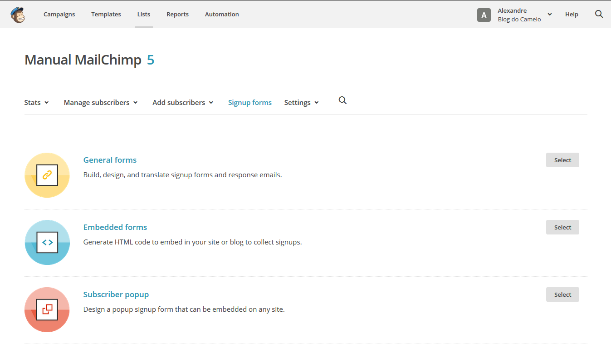
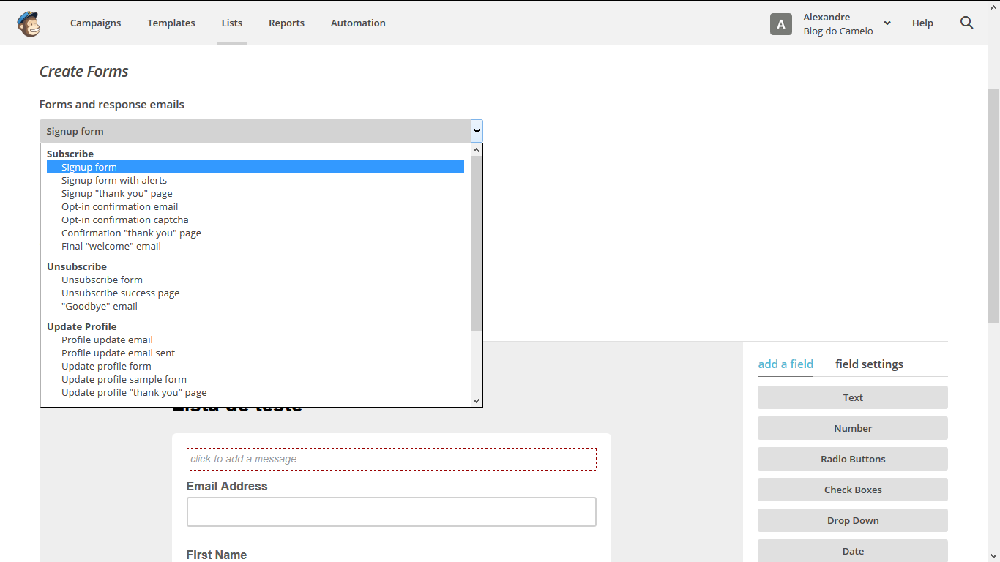
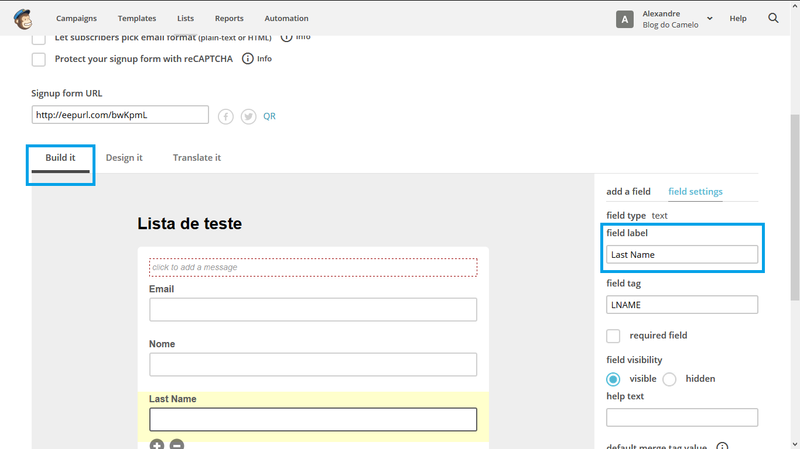
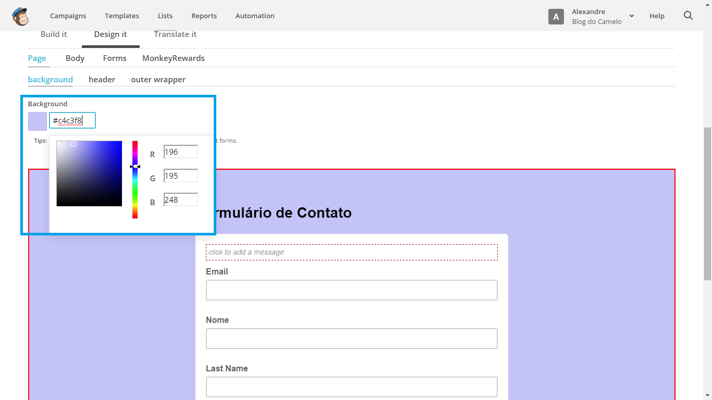
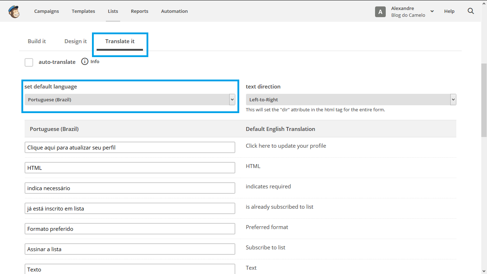
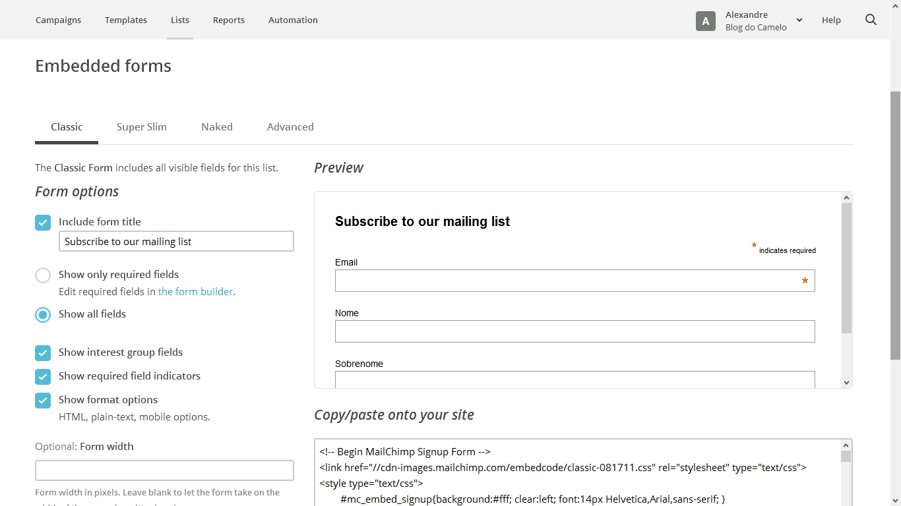

# Formulários

### Criando um formulário de inscrição

O formulário no MailChimp permite que as pessoas consigam se inscrever diretamente na sua lista de e-mails, isso acontece em diversos sites onde geralmente pedem seu e-mail em cadastros como Newsletter, cadastrando seu e-mail para recebê-las automaticamente seu e-mail é adicionado na lista do site em questão.

É importante salientar que todos os usuários devem autorizar que seus e-mails sejam adicionados em uma lista de e-mails, adicionar sem a devida autorização pode até gerar processos.

Para que possamos criar um formulário, acesse o menu Lists dê um clique sobre o nome da lista em que se deseja criar o formulário em seguida em **Signup forms**. Uma tela como mostra abaixo é exibida, para montar o seu formulário clique em **General forms**.

* **General forms**: Construir, design, e traduzir formulários de inscrição e e-mails de resposta.
* **Embedded forms**: Gerar o código HTML para inserir em um site/blog para coletar inscrições.
* **Subscriber popup**: Projetar um formulário de inscrição popup que pode ser inserido em qualquer site.
* **Form integrations**: Crie formulários de inscrição usando uma das formas de integrações do MailChimp.

Veremos então o **General Forms**

A opção Subscribe é a principal opção que vamos trabalhar, nela estão contidos todos os passos para a inscrição do leitor, temos a página de cadastro, página de agradecimento e por ai vai, podemos personalizar todos eles.

* **Sign up forms**: formulário principal para inscrição
* **Sign up with alerts**: essa é a página que surge quando alguém insere uma informação errada
* **Sign up thank you page**: Aqui é a página de agradecimento, ela é carregada quando o leitor assina a lista
* **Opt-in e-mail**: é o e-mail de confirmação da assinatura
* **Confirmation thank you page**: Essa é a página que carrega quando o leitor clicar no link de confirmação do e-mail
* **Final welcome e-mail**: é o e-mail de boas vindas após a confirmação da inscrição, porém podemos escolher não enviar

### Criando o formulário - Build it

Em Build it selecionamos os campos que devem compor o formulário, o ideal é que tenha a menor quantidade de campos possível, assim as chances de as pessoas estarem dispostas a se cadastrar em sua lista vai ser maior pois não terão que preencher um volume grande de campos, o melhor é pedir apenas o nome, sobrenome e e-mail, para alterar o nome dos campos basta clicar em cima do mesmo para modificar, o nome dos campos é alterado em Field Label, para salvar as alterações clique em **Save Field**.

### Como melhorar a aparência do formulário - Design it

Podemos estilizar o formulário utilizando a função Design it, aqui selecionamos as cores do formulário para que ele tenha as cores da identidade visual da sua empresa.

### Traduzindo o formulário Translate it

Aqui podemos selecionar o idioma "oficial", após escolher o idioma em Set Default Language temos que modificar os textos de acordo com as necessidades.

### Compartilhando o Formulário - Share it

A opção Share it permite que após o formulário for criado possamos compartilhá-lo em um site da web, para isso volte para a opção Signup forms clique sobre Embedded forms, aqui será gerado um código HTML que deveria ser inserido no site para que o formulário apareça.

Desta forma finalizamos a criação do formulário, sempre que qualquer usuário preencher o formulário será automaticamente incluído na sua lista.