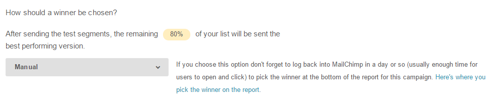

# Teste A/B

### O que é um Teste A/B

O teste A/B permite que enviemos duas variáveis diferentes de um mesmo e-mail para uma parcela da sua lista de contatos. O principal objetivo disso é conseguir identificar a variável que responde com o melhor resultado (abertura de e-mail, cliques e etc) e enviá-la para o resto dos assinantes da lista.

### O que poderemos testar?

Para uma campanha de e-mail marketing, é possível testar a taxa de abertura e de cliques de um e-mail a partir das variáveis abaixo:

* Subject lines (Assunto): Teste pequenas ou grandes variáveis no assunto, desde um assunto com um tom mais pessoal, ou algo mais sério/tradicional.
* From names (De quem): Testar se os assinantes encontram maior afinidade com o e-mail da empresa ou com o nome de uma pessoa.
* Delivery date/time (Data e horário de entrega): Testar o melhor dia e horário para enviar os e-mails.
* Content (Conteúdo): Teste imagens layouts ou estilo das mensagens do conteúdo.

Ao fazer um teste A/B é muito importante analisar o desempenho de cada uma das variáveis citadas acima, sendo assim não podemos mudar tudo de uma vez durante os testes, o ideal é testar pequenas mudanças aos poucos, isso criará condições de descobrir o que realmente está causando as diferenças entre os testes A/B.

É possível definir um vencedor a partir da taxa de abertura (open rate), do número de cliques (click rate) e também manualmente, o que permite que você escolha o ganhador a partir do relatório apresentado.

### Criando um teste A/B para uma campanha

Vá até a página de campanhas clicando em **Campaing**, em seguida clique em **Create Campaign**, **A/B Split Campaing**.

Selecione o que deve ser testado logo abaixo de **What would you like to test**?

### Criando um teste A/B para uma campanha

Vá até a página de campanhas clicando em Campaing, em seguida clique em **Create Campaign**, **A/B Split Campaing**.

Selecione o que deve ser testado logo abaixo de **What would you like to test?**

**Importante**: opte sempre por testar uma parcela pequena da sua base de dados, por exemplo entre 20% e 40%, sendo assim, você evita que muitos usuários fiquem comprometidos dentro de um teste que justamente decidirá a variável com mais êxito.

Em **How should a winner be chosen?**, escolha o parâmetro mais importante para determinar o vencedor do teste, o qual pode ser a taxa de abertura (open rate), a taxa de cliques (click rate) ou manual, e quanto tempo depois de enviado o teste deverá aparecer um vencedor. Espere algumas horas até que um vencedor possa ser decretado.

Clique em **Next** e em **Recipients** (lista de destinatários) deve-se escolher alguma das listas disponíveis ou segmentos para receber o e-mail que vamos enviar, após ter escolhido os destinatários clique em **Next** e prossiga para o **Setup** da campanha.

Agora defina os parâmetros da campanha em E-mail subject, From Names e etc.

Clique em **Next** e escolha algum dos template disponíveis, em seguida clique em Next novamente para a etapa de Design, deve-se notar que o mesmo conteúdo irá para ambas as mensagens, exceto quando você decidir tentar o conteúdo, feito as devidas configurações clique em **Next** novamente para a etapa final **Confirm**.

Revise todos os passos feitos até então, se você optou por testar **Subject lines** e From names, poderá enviar o e-mail diretamente em **Send Now** ou se preferir agendar. Se optar por testar o dia e horário o e entrega Delivery Date/time clique em **Schedule** e defina as datas e horários antes de clicar em **Schedule Campaign**.

### Escolha manual do vencedor

No menu onde você cria a campanha e logo abaixo de **How should a winner be chosen?**, selecione o item Manual.

Após a parcela teste da sua campanha ter sido enviada, você pode acompanhar as estatísticas diretamente clicando em Reports em seguida em **A/B split results**.

Clique na aba para visualizar a dupla coluna de resultados.

No final da página de **A/B split results**, escolha a campanha melhor desempenho analisando as métricas apresentadas como mostra a imagem abaixo. Clique em **Pick up Group A** ou **Pick up group B** de acordo com a análise, maior taxa de abertura, cliques, etc.

A mensagem vencedora (A ou B) será enviada após o período de tempo que você estabelecer. Por exemplo, se você escolheu o período de um dia, sua campanha será enviada para o resto dos usuários um dia após você ter determinado a mensagem ganhadora.