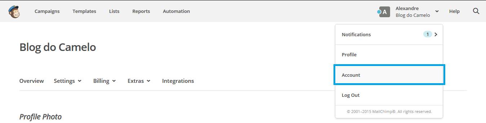
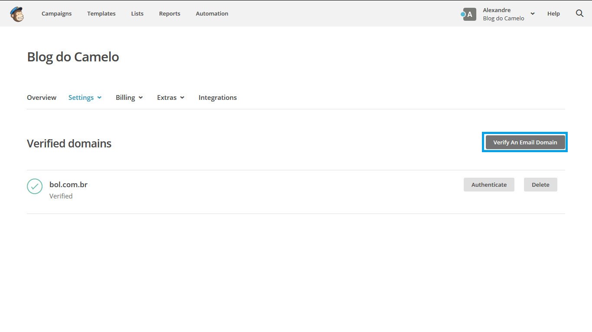
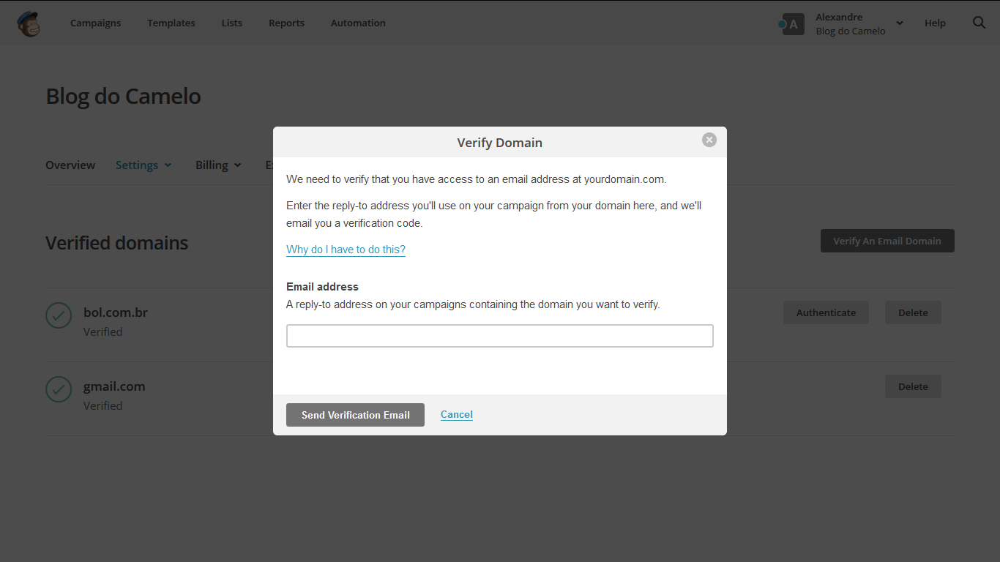
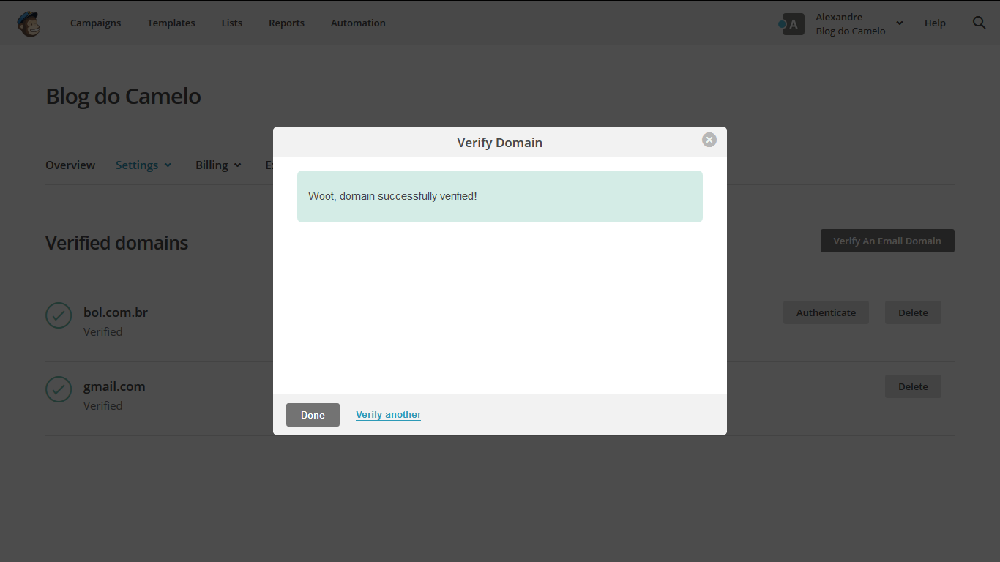
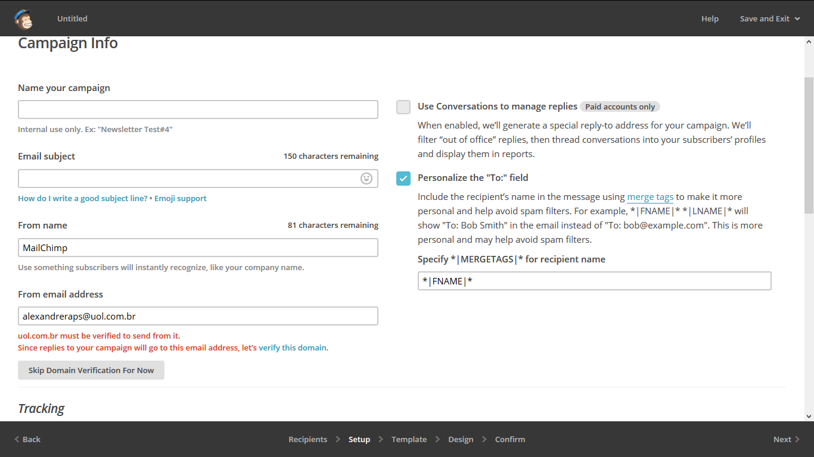

# Verificação de domínio

### Verificação de domínio durante a criação da campanha

A verificação de domínio tem como principio garantir que ninguém se passe por você enviando campanha de e-mail marketing no MailChimp, portanto, o MailChimp verifica se estamos utilizando um endereço de e-mail válido, assim manterá suas campanhas fora das pastas de spam e também proteger a sua reputação como remetente.

Nos casos em que usamos e-mails gratuitos como os domínios GMAIL, UOL, Hotmail e etc não é necessário a verificação já que o MailChimp a faz automaticamente, porém, se vamos enviar campanhas a partir de um domínio pessoal ou da empresa teremos que passar pelo processo de verificação antes que possamos enviar qualquer campanha através do MailChimp.

### Verificar o domínio em Configurações da conta

Clique no seu nome de perfil localizado na área superior direita para abrir o Painel de conta e selecione **Account** (conta).

Clique no menu Settings e selecione a opção **Verified domains**.

Na janela que abrir a seguir, clique no botão **Verify an E-mail Domain**.

Digite o seu e-mail com o domínio que quer validar em seguida clique em **Send Verification to e-mail**.

Após isso verifique no seu e-mail e notará q foi enviado um e-mail do MailChimp, abra o e-mail, em seguida clique no link V**erify Domain Access** ou copie o código de verificação e cole na janela do MailChimp.

Aparecerá uma mensagem dizendo que o domínio foi verificado com êxito, clique em Done para fechar a janela pop-up para verificar os domínios.

### Como verificar o domínio no construtor de campanha

Vá até a etapa onde criamos uma campanha (no menu superior opção **Campaigns>Create Campaigns**), digite o endereço de e-mail que desejamos usar na campanha.

Após preencher os demais dados clique no botão **Next** no canto inferior para atualizar a tela, uma mensagem de exigência irá surgir indicando a necessidade de se fazer a verificação.

Clique no link **Verify this domain**.

Digite o e-mail do domínio a ser verificado em seguida clique em **Send Verification E-mail**, após receber o e-mail de verificação, clique no link ou copie e cole o código na janela pop-up, em seguida clique no botão **Verify Me**.

Excluir um domínio já verificado

Caso necessário pode-se remover um domínio da lista de domínios verificados a qualquer momento, para isso basta seguir os passos abaixo:

Clique no seu nome de perfil para abrir o Painel de conta e clique em **Account**.

No menu **Settings** em seguida Verified Domains, do lado direito do domínio que deseja-se apagar, clique no botão Excluir, na janela de confirmação clique novamente em excluir.

A janela será atualizada e exibirá em seguida uma mensagem de sucesso.

