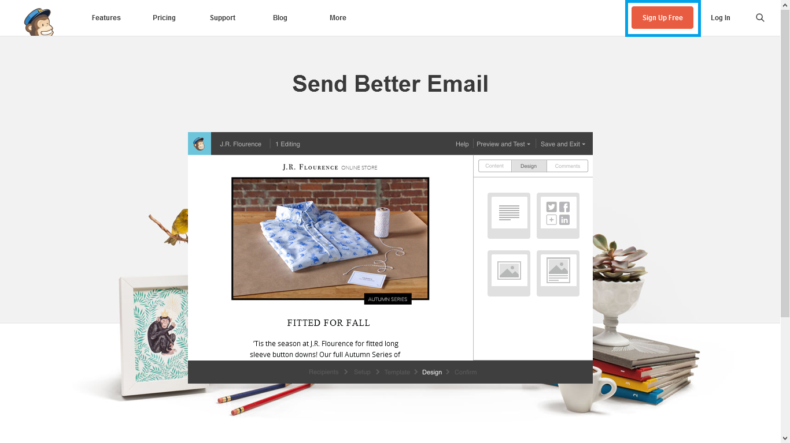
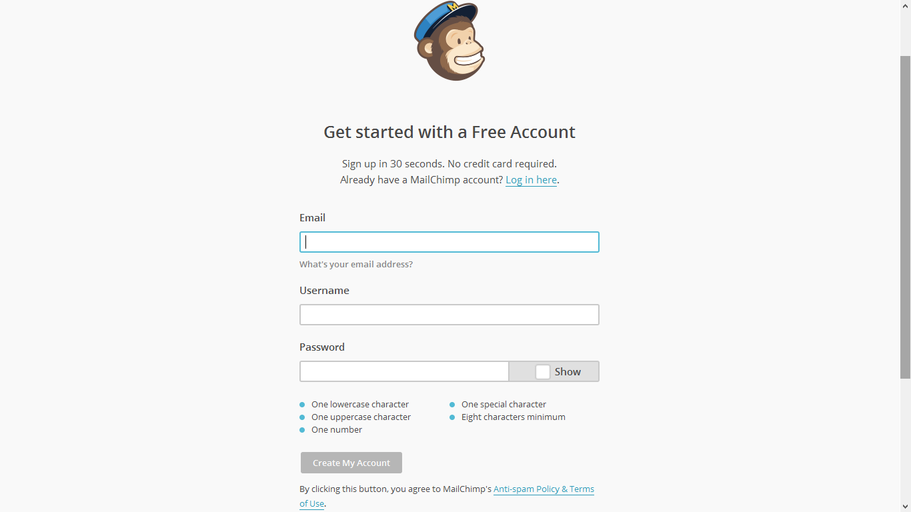
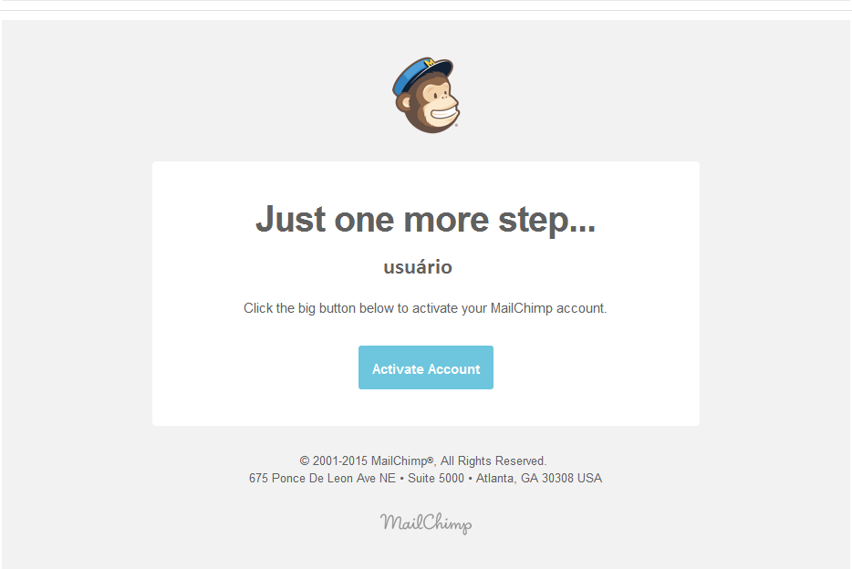
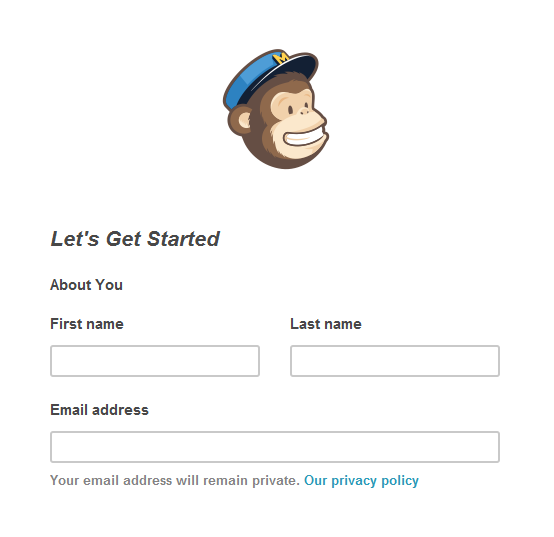
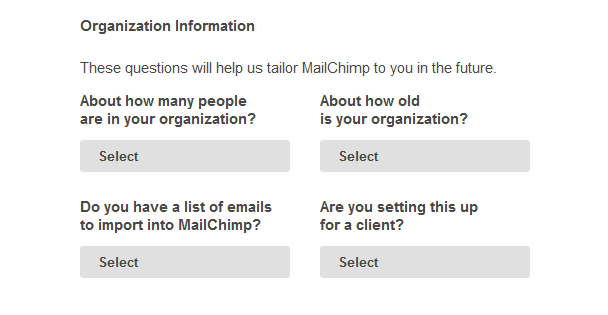
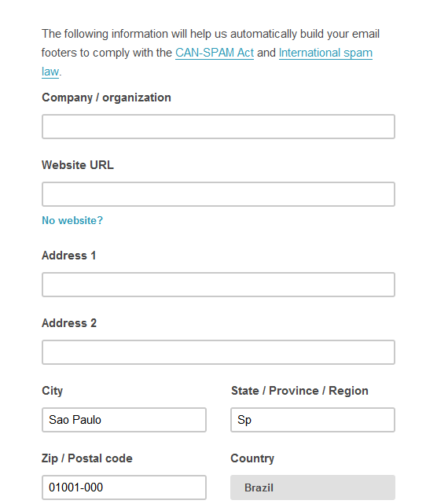
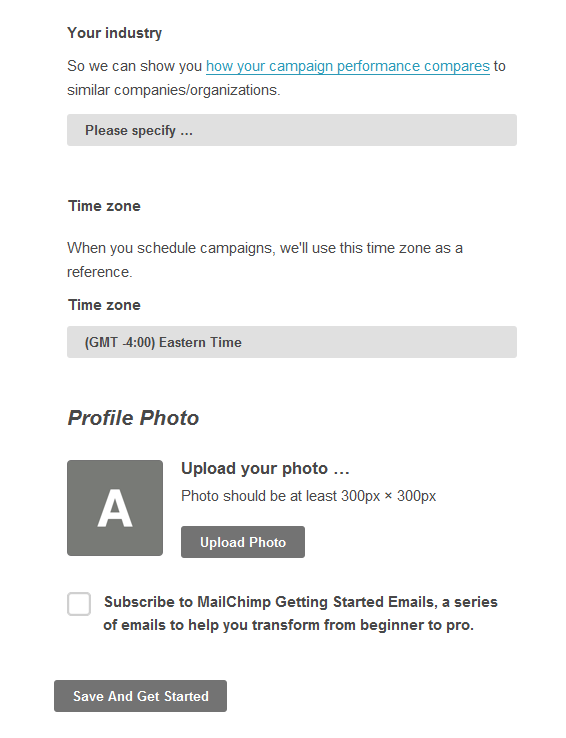

# Criando uma Conta

Abra o site do Mailchimp http://mailchimp.com/

Clique no botão **Sign Up Free**, localizado na parte superior direita do site.

Preencha os dados solicitados conforme imagem abaixo, após preencher clique no botão **Create My Account**.

Em seguida, abra o e-mail utilizado durante o cadastro, abra o e-mail enviado pelo MailChimp e clique em **Activate Account**.

Agora é hora de finalizar o cadastro, para isso preencha os campos que apareceram após a confirmação no seu e-mail, digite Nome, Sobrenome e e-mail.

Mais abaixo, preencher as informações da empresa/projeto tais como:

- Quantas pessoas há na sua empresa;
- Idade;
- Se você tem uma lista de e-mails para importar para o MailChimp;
- Se você está criando essa conta para um cliente;

Mais informações da empresa/projeto:

- Nome da organização
- Site
- Endereço

Mais informações da empresa/projeto:
- O setor da organização
- Fuso horário
- Foto do perfil (opcional)

Para finalizar clique no botão **Save And Get Started**.

